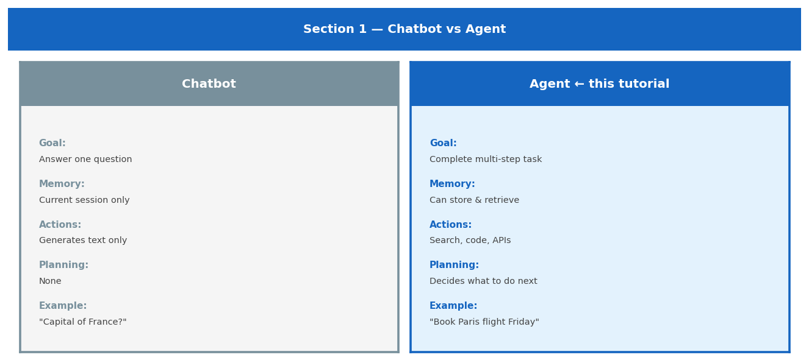
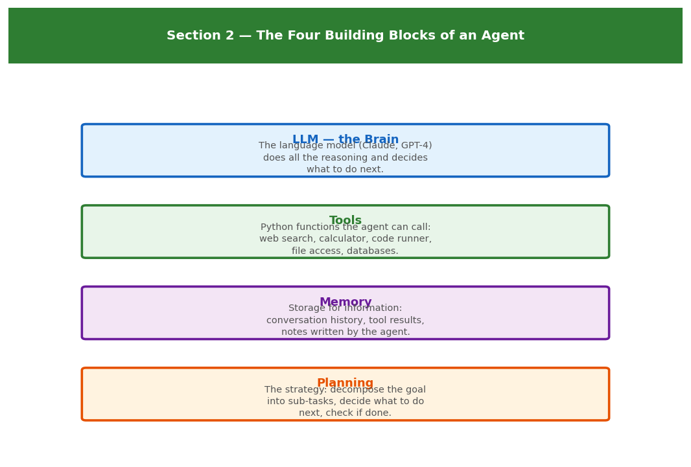
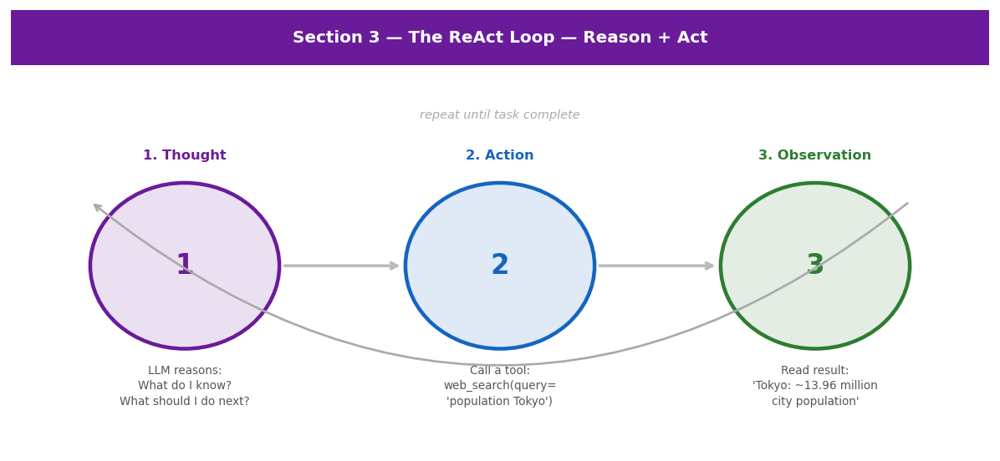
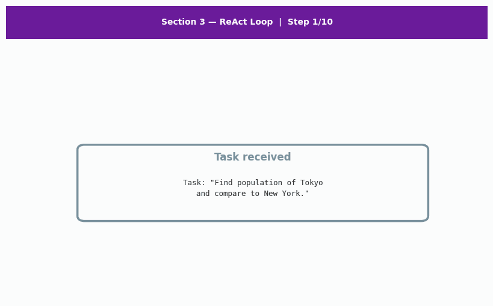
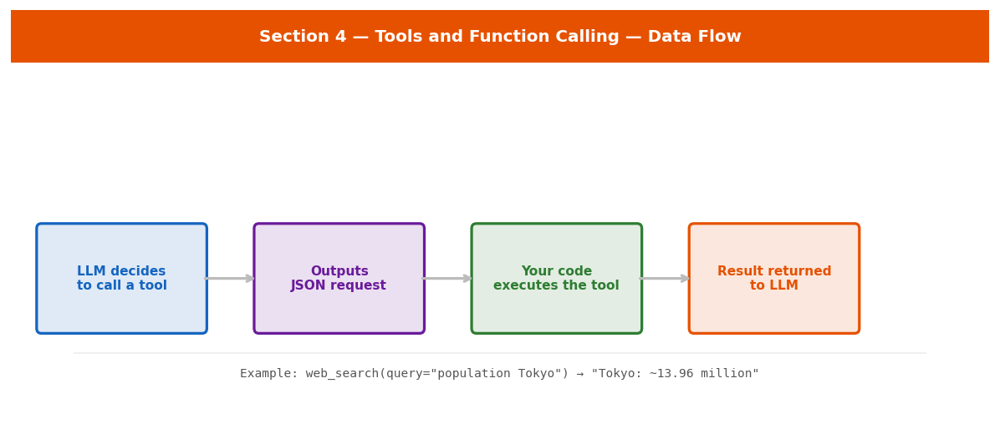
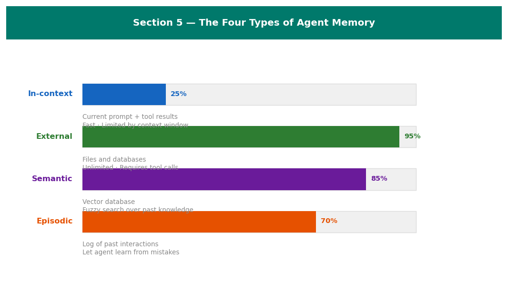
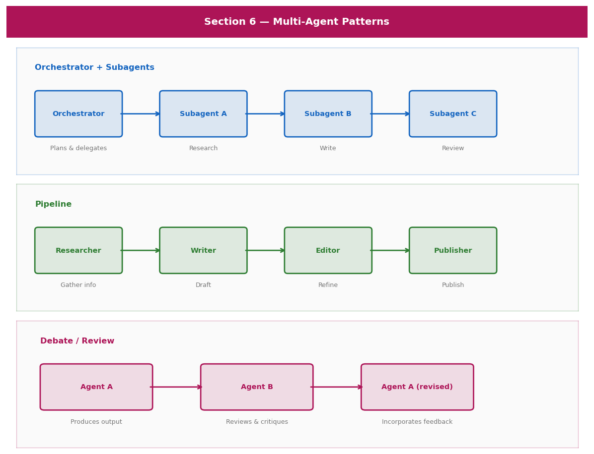
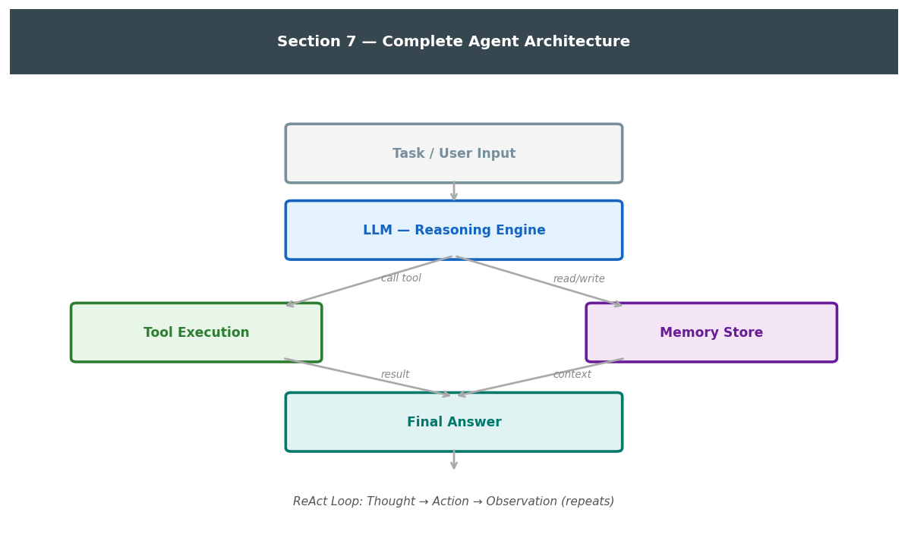

<div align="center">

<h1>Agentic AI: From LLMs to Autonomous Agents — A Tutorial</h1>

<p><em>A structured introduction to Agentic AI — what it is, how it works, and how to build one.<br>
No prior AI knowledge required.</em></p>


</div>

\---

## Contents

|#|Section|Topic|
|-|-|-|
|1|[What is Agentic AI?](#1--what-is-agentic-ai)|Chatbot vs agent, real examples, terminology|
|2|[The Building Blocks](#2--the-building-blocks-of-an-agent)|LLM, tools, memory, planning|
|3|[The ReAct Loop](#3--how-agents-think--the-react-loop)|Thought → Action → Observation|
|4|[Tools and Function Calling](#4--tools-and-function-calling)|Defining tools, JSON schemas, tool flow|
|5|[Memory and Context](#5--memory-and-context)|Four memory types, context window|
|6|[Multi-Agent Systems](#6--multi-agent-systems)|Orchestrator, pipeline, debate patterns|
|7|[Build Your Own Agent](#7--build-your-own-agent)|Full Python implementation with Anthropic API|

> \*\*Files in this repo\*\*
> - `AgenticAI\_Workshop\_ABRHS\_ResearchClub.ipynb` — interactive Jupyter notebook
> - `AgenticAI\_Workshop\_ABRHS\_ResearchClub.html` — standalone interactive HTML tutorial
> - `README.md` — this rendered report
> - `assets/` — all images and animated GIFs

\---

## 1 — What is Agentic AI?



|Feature|Chatbot|Agent|
|-|-|-|
|Goal|Answer one question|Complete a multi-step task|
|Memory|Current session only|Can store and retrieve information|
|Actions|Generates text only|Search web, run code, call APIs|
|Planning|None|Decides what to do next|

> \*\*Important:\*\* In this tutorial, "agent" means a language model given tools and a task to complete autonomously.
> This is different from the "agent" in the Q-Learning tutorial (a program maximising reward in an environment).

\---

## 2 — The Building Blocks of an Agent



|Component|Role|
|-|-|
|**LLM**|The reasoning engine — reads situation and decides next step|
|**Tools**|Python functions — actually do things in the world|
|**Memory**|Stores information across steps|
|**Planning**|Decomposes goals into sub-tasks|

\---

## 3 — How Agents Think — the ReAct Loop





```python
# The ReAct loop — pseudocode
if False:
    while not finished:
        thought = llm.think(task, history, tools)       # Reason
        if thought.is\_final\_answer:
            print(thought.answer); finished = True
        else:
            result  = tools\[thought.tool\_name].call(thought.tool\_input)  # Act
            history.append({"tool": thought.tool\_name, "result": result}) # Observe
```

\---

## 4 — Tools and Function Calling



```python
def web\_search(query: str) -> str:
    return f"Results for '{query}': ..."

web\_search\_schema = {
    "name":        "web\_search",
    "description": "Search the internet for current information on any topic.",
    "input\_schema": {"type":"object","properties":{"query":{"type":"string"}},"required":\["query"]}
}
```

\---

## 5 — Memory and Context



|Type|Duration|Capacity|
|-|-|-|
|**In-context**|This session|Limited by context window|
|**External**|Permanent|Unlimited (files, databases)|
|**Semantic**|Permanent|Vector search over past knowledge|
|**Episodic**|Permanent|Log of past interactions|

\---

## 6 — Multi-Agent Systems



\---

## 7 — Build Your Own Agent



Dependencies: `pip install anthropic`

```python
def run\_agent(task: str, api\_key: str):
    client   = anthropic.Anthropic(api\_key=api\_key)
    messages = \[{"role": "user", "content": task}]
    while True:
        response = client.messages.create(
            model="claude-opus-4-5", max\_tokens=1024,
            tools=TOOLS, messages=messages
        )
        messages.append({"role": "assistant", "content": response.content})
        if response.stop\_reason == "end\_turn":
            return next(b.text for b in response.content if hasattr(b, "text"))
        tool\_results = \[]
        for block in response.content:
            if block.type == "tool\_use":
                result = TOOL\_FNS\[block.name](\*\*block.input)
                tool\_results.append({"type":"tool\_result","tool\_use\_id":block.id,"content":result})
        messages.append({"role": "user", "content": tool\_results})
```

```
Tool: web\_search({'query': 'population Tokyo'}) → Tokyo: \~13.96 million
Tool: web\_search({'query': 'population New York'}) → New York City: \~8.3 million.
Tool: calculator({'expression': '13.96/8.3'}) → 1.6819...
Final: Tokyo (13.96M) is approximately 1.68× larger than New York City (8.3M).
```

\---

## Summary

|Concept|What it does|
|-|-|
|**LLM**|Reasoning engine — decides what to do at each step|
|**Tools**|Python functions the LLM can call|
|**Memory**|Context window plus optional external storage|
|**ReAct loop**|Thought → Action → Observation, repeated until done|
|**Multi-agent**|Multiple specialised agents for complex tasks|

Agents = LLM + Tools + Memory + ReAct loop.

\---

*Tutorial produced as part of the ABRHS Research Club workshop series.*

