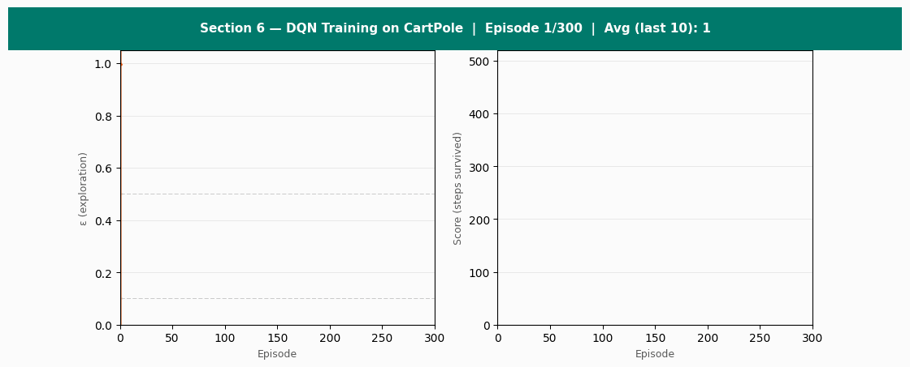
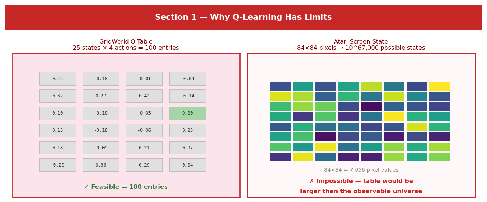
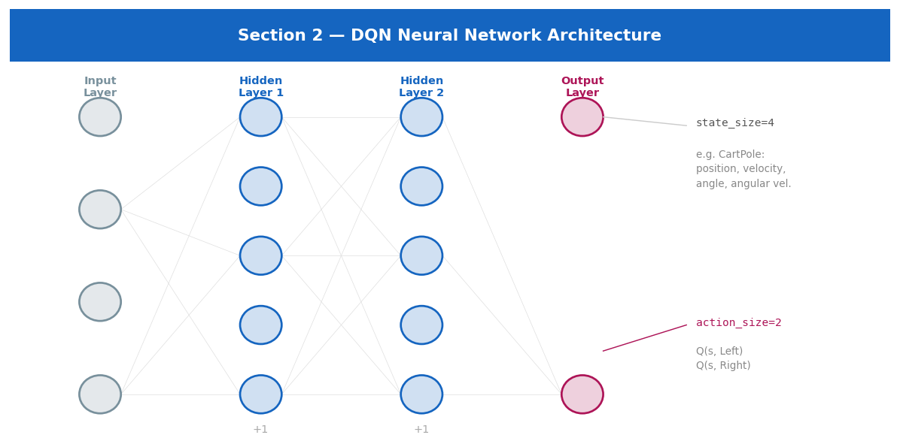
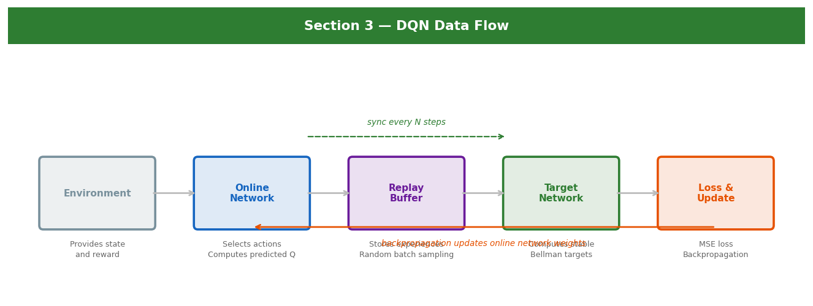
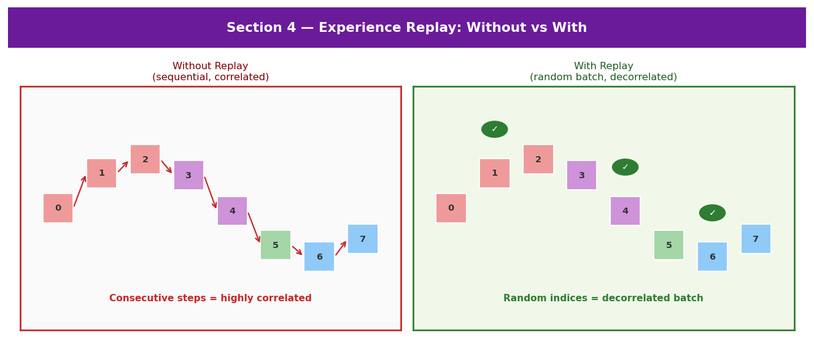
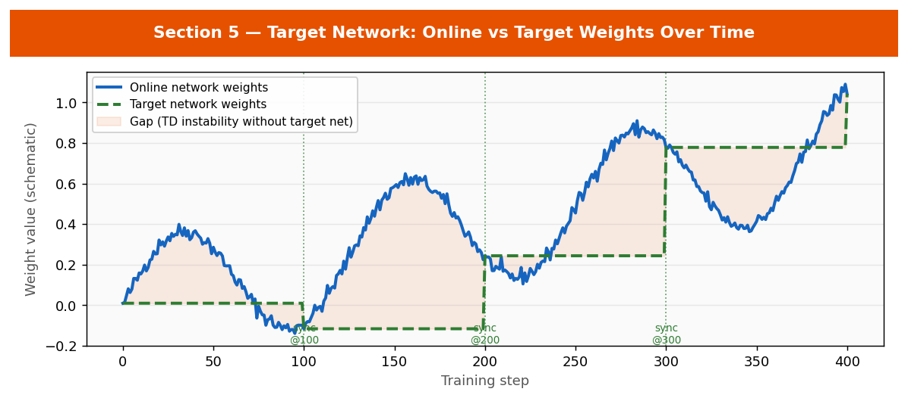
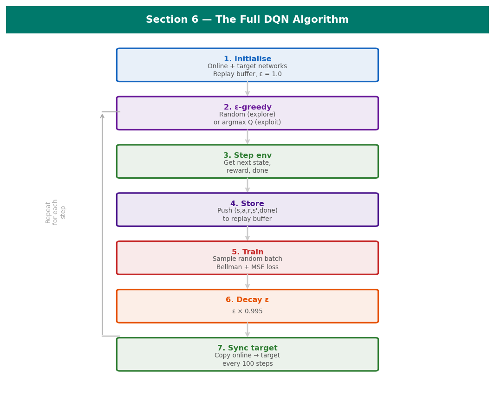
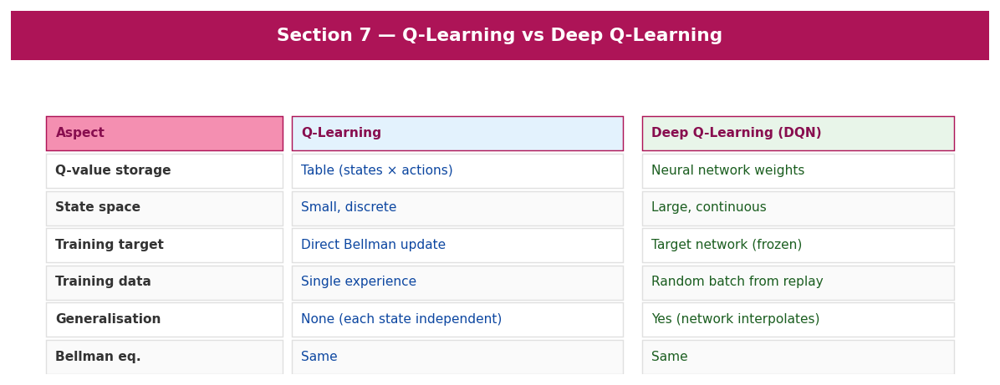

<div align="center">

<h1>Deep Q-Learning: From Q-Learning to Neural Networks — A Tutorial</h1>

<p><em>A structured extension of the Q-Learning tutorial. Covers why Q-Learning breaks down on complex problems<br>
and how Deep Q-Networks (DQN) solve it.</em></p>



</div>

---

> **Prerequisite:** Complete the [Q-Learning tutorial](../README.md) first.
> Familiarity required: agent, environment, state, action, reward, Q-Table, Bellman equation, ε-greedy.

## Contents

| # | Section | Topic |
|---|---------|-------|
| 1 | [Why Q-Learning has limits](#1--why-q-learning-has-limits) | Table size problem, state space explosion |
| 2 | [Neural Networks intro](#2--neural-networks--a-quick-introduction) | Layers, weights, backpropagation |
| 3 | [DQN Architecture](#3--the-dqn-architecture) | Online network, replay buffer, target network |
| 4 | [Experience Replay](#4--experience-replay) | Circular buffer, random batch sampling |
| 5 | [Target Network](#5--the-target-network) | Stable Bellman targets, periodic sync |
| 6 | [Full DQN Algorithm](#6--the-full-dqn-algorithm) | Complete algorithm, comparison with Q-Learning |
| 7 | [Full Python Code](#7--full-python-implementation) | PyTorch implementation on CartPole-v1 |

> **Files in this repo**
> - `DeepQLearning_Workshop_ABRHS_ResearchClub.ipynb` — interactive Jupyter notebook
> - `DeepQLearning_Workshop_ABRHS_ResearchClub.html` — standalone interactive HTML tutorial
> - `README.md` — this rendered report
> - `assets/` — all images and animated GIFs

---

## 1 — Why Q-Learning Has Limits

<div style="background:#fce4ec;border-left:4px solid #c62828;padding:12px 16px;border-radius:4px;margin:10px 0">
<strong style="color:#c62828">The problem:</strong> Q-Tables only work when the number of states is small and discrete.
Real environments have state spaces that are either enormous or continuous.
</div>



| Environment | State space | Q-Table feasible? |
|-------------|------------|-------------------|
| GridWorld | 25 states | Yes — 100 entries |
| Taxi-v3 | 500 states | Yes — 3,000 entries |
| Atari Breakout | 84×84 pixels | **No — 10^67,000 states** |
| Robotics arm | Continuous | **No — infinite states** |

**The solution:** Replace the Q-Table with a **neural network** that *approximates* Q-values.
Given a state, the network outputs one Q-value per action — and it **generalises** to unseen states.

---

## 2 — Neural Networks — a Quick Introduction



A neural network has three types of layers:

- **Input layer** — receives the raw state (position, velocity, pixel values, etc.)
- **Hidden layers** — transform the input through learned weights and ReLU activations
- **Output layer** — one Q-value per action (identical role to a Q-Table row)

```python
class QNetwork(nn.Module):
    def __init__(self, state_size, action_size, hidden=64):
        super().__init__()
        self.net = nn.Sequential(
            nn.Linear(state_size, hidden), nn.ReLU(),
            nn.Linear(hidden, hidden),      nn.ReLU(),
            nn.Linear(hidden, action_size),  # one output per action
        )
    def forward(self, x):
        return self.net(x)
```

> **Key Takeaway:** The Bellman equation is unchanged. The network replaces only the storage mechanism.
> `action = argmax(network(state))` is identical to `action = argmax(Q_table[state])`.

---

## 3 — The DQN Architecture



| Component | Updated | Used for |
|-----------|---------|---------|
| **Online network** | Every step | Action selection + predicted Q |
| **Replay buffer** | Every step (push) | Random batch training |
| **Target network** | Every N steps | Stable Bellman targets |

---

## 4 — Experience Replay



**Without replay:** Train on step (t), (t+1), (t+2) — highly correlated, causes catastrophic forgetting.

**With replay:** Sample step (t=847), (t=3), (t=1204) at random — decorrelated, stable learning.

```python
class ReplayBuffer:
    def __init__(self, capacity=10_000):
        self.buffer = deque(maxlen=capacity)  # oldest overwritten when full

    def push(self, state, action, reward, next_state, done):
        self.buffer.append((state, action, reward, next_state, done))

    def sample(self, batch_size):
        return random.sample(self.buffer, batch_size)  # RANDOM, not sequential
```

> **Key Takeaway:** Experience replay breaks temporal correlation, allows experiences to be reused,
> and makes training far more stable.

---

## 5 — The Target Network



Without a target network, the Bellman target shifts every step — we are chasing a moving goal.

```python
# WITHOUT target network (unstable):
target = reward + gamma * online_net.forward(next_state).max()  # target changes every step!

# WITH target network (stable):
target = reward + gamma * target_net.forward(next_state).max()  # frozen for N steps

# Sync target every 100 steps:
target_net.load_state_dict(online_net.state_dict())
```

> **Key Takeaway:** The target network provides stable Bellman targets.
> It is a frozen copy of the online network, synced periodically.

---

## 6 — The Full DQN Algorithm





| Step | What happens |
|------|-------------|
| **1. Initialise** | Online + target networks (same weights), empty replay buffer, ε = 1.0 |
| **2. ε-greedy** | Explore (random) or exploit (argmax online network) |
| **3. Step env** | Get next state, reward, done |
| **4. Store** | Push (s, a, r, s', done) to replay buffer |
| **5. Train** | Sample random batch, compute Bellman targets (target net), MSE loss, backprop |
| **6. Decay ε** | ε × 0.995 |
| **7. Sync target** | Every 100 steps: copy online → target |

> **Key Takeaway:** DQN = Q-Learning + neural network + replay buffer + target network.
> The Bellman equation and ε-greedy are unchanged.

---

## 7 — Full Python Implementation

Dependencies: `pip install torch gymnasium numpy`

```python
import torch, torch.nn as nn, torch.optim as optim
import numpy as np, random, gymnasium as gym
from collections import deque

class QNetwork(nn.Module):
    def __init__(self, state_size, action_size, hidden=64):
        super().__init__()
        self.net = nn.Sequential(
            nn.Linear(state_size, hidden), nn.ReLU(),
            nn.Linear(hidden, hidden),      nn.ReLU(),
            nn.Linear(hidden, action_size),
        )
    def forward(self, x): return self.net(x)

class ReplayBuffer:
    def __init__(self, capacity=10_000): self.buf = deque(maxlen=capacity)
    def push(self, *args): self.buf.append(args)
    def sample(self, n): return zip(*random.sample(self.buf, n))
    def __len__(self): return len(self.buf)

def train_step(online, target, buf, optimizer, batch_size=32, gamma=0.99):
    states, actions, rewards, next_states, dones = buf.sample(batch_size)
    states      = torch.FloatTensor(np.array(states))
    actions     = torch.LongTensor(actions)
    rewards     = torch.FloatTensor(rewards)
    next_states = torch.FloatTensor(np.array(next_states))
    dones       = torch.FloatTensor(dones)
    q_pred   = online(states).gather(1, actions.unsqueeze(1)).squeeze()
    with torch.no_grad():
        q_target = rewards + gamma * target(next_states).max(1)[0] * (1 - dones)
    loss = nn.MSELoss()(q_pred, q_target)
    optimizer.zero_grad(); loss.backward(); optimizer.step()
    return loss.item()

# Run: model, history = train_dqn(num_episodes=500)
```

```
Episode    0 | Score:    9.0 | ε: 1.000
Episode   50 | Score:   23.0 | ε: 0.778
Episode  100 | Score:   68.0 | ε: 0.606
Episode  200 | Score:  187.0 | ε: 0.368
Episode  300 | Score:  412.0 | ε: 0.223
Episode  400 | Score:  490.0 | ε: 0.135
```

---

## Summary

| Concept | Role |
|---------|------|
| **Q-Table limit** | Cannot scale to large/continuous state spaces |
| **Neural network** | Approximates Q(s,a) for any state, generalises |
| **Replay buffer** | Breaks correlation, enables experience reuse |
| **Target network** | Frozen Bellman targets, prevents training divergence |
| **Bellman equation** | Unchanged from Q-Learning |
| **ε-greedy** | Unchanged from Q-Learning |

DQN = Q-Learning + three engineering improvements that make it scale.

---
*Tutorial produced as part of the ABRHS Research Club workshop series.*
