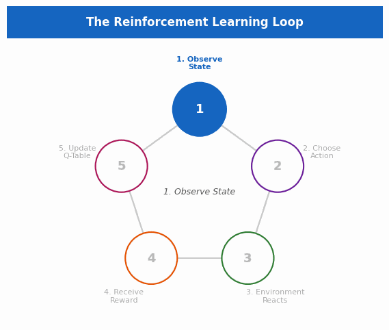
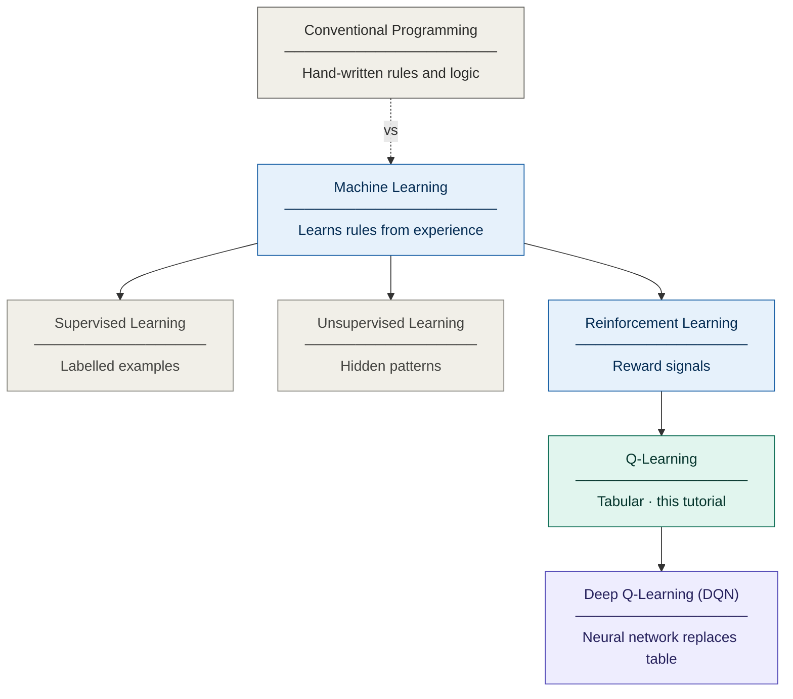
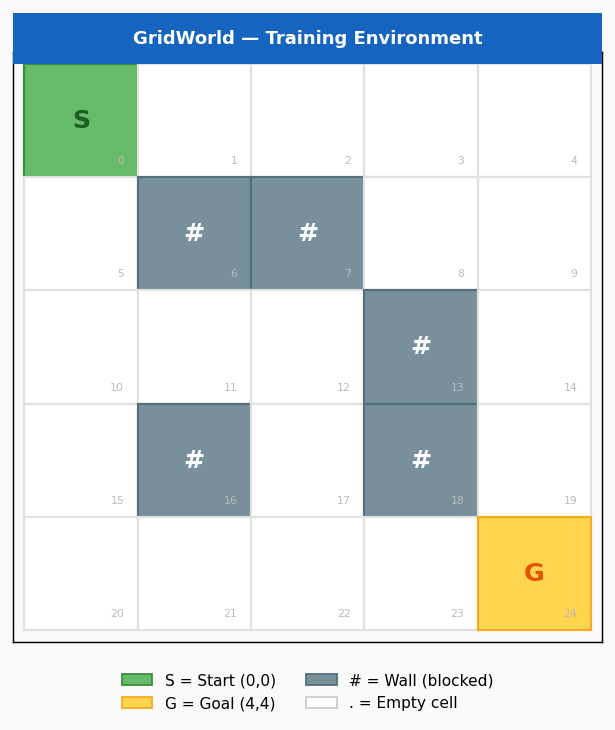
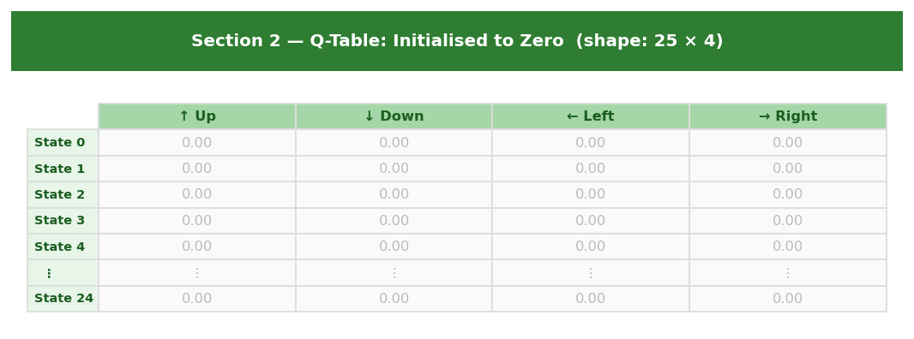
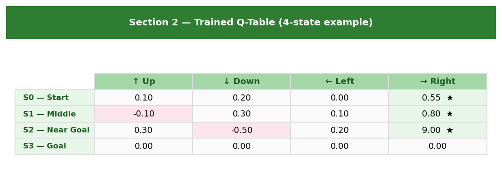
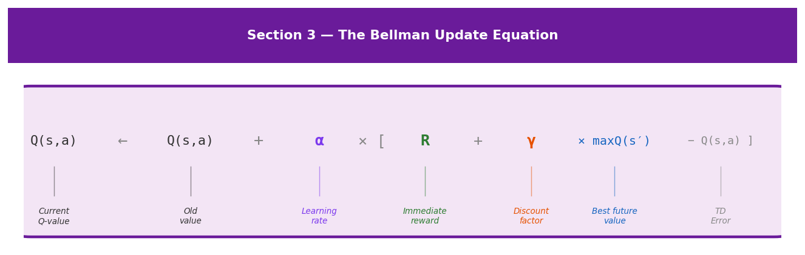
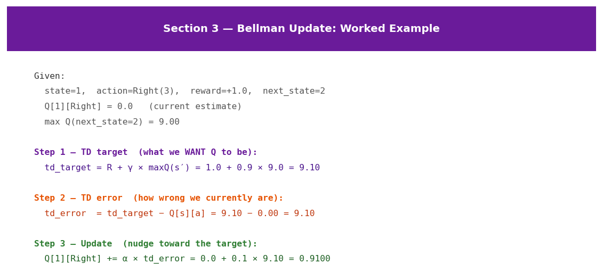
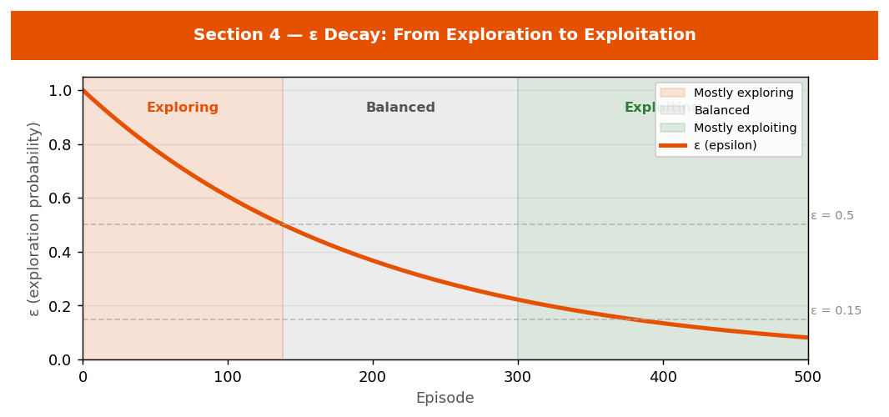
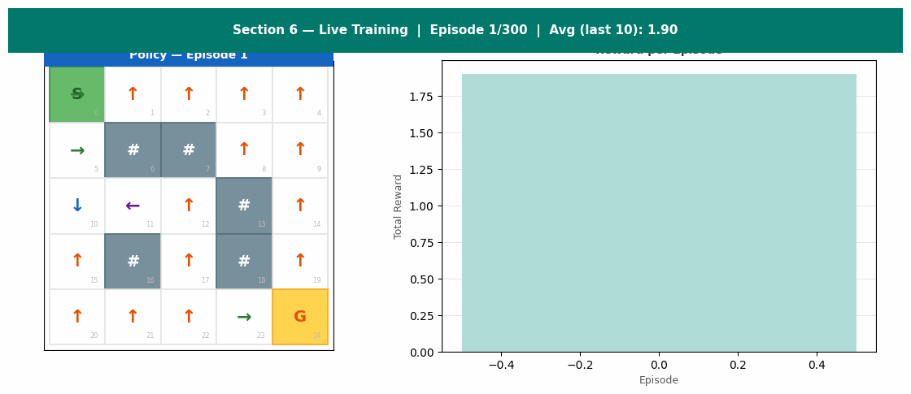
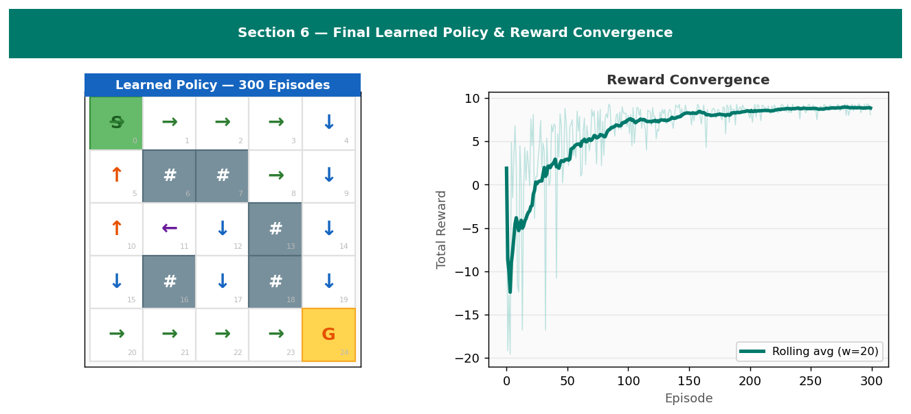

<div align="center">

<h1>Reinforcement Learning &amp; Q-Learning Workshop</h1>
<h3>ABRHS Research Club &nbsp;·&nbsp; Q-Learning: From Zero to Reinforcement Learning</h3>

<p><em>A structured, hands-on introduction to Reinforcement Learning built around one of its most important algorithms.<br>
No prior machine learning knowledge required.</em></p>



</div>

---

## Contents

| # | Section | Topic |
|---|---------|-------|
| 1 | [What is Machine Learning?](#1-what-is-machine-learning) | ML types, RL definition, vocabulary |
| 2 | [The Q-Table](#2-the-q-table--the-agents-memory) | Structure, initialisation, trained values |
| 3 | [The Bellman Equation](#3-the-bellman-equation) | Update rule, learning rate, discount factor |
| 4 | [Exploration vs Exploitation](#4-exploration-vs-exploitation) | ε-greedy policy, ε-decay |
| 5 | [The Full Algorithm](#5-the-full-algorithm) | Complete Q-Learning loop |
| 6 | [Live Training Demonstration](#6-live-training-demonstration) | Training GIF, reward convergence |
| 7 | [Full Python Implementation](#7-full-python-implementation) | Runnable code |

> **Files in this repo**
> - `ReinforcementLearning_QLearning_Workshop_ABRHS_ResearchClub.ipynb` — interactive Jupyter notebook (run locally or on Google Colab)
> - `ReinforcementLearning_QLearning_Workshop_ABRHS_ResearchClub.html` — interactive HTML tutorial (open in any browser)
> - `README.md` — this rendered report (always visible on GitHub)
> - `assets/` — all images and animated GIFs

---

<div align="center">
<table><tr>
<td align="center"><b>Dependencies</b></td>
<td><code>pip install numpy matplotlib</code></td>
</tr><tr>
<td align="center"><b>Python</b></td>
<td>3.8 or higher</td>
</tr><tr>
<td align="center"><b>Run on Colab</b></td>
<td><a href="https://colab.research.google.com/">Open in Google Colab</a></td>
</tr></table>
</div>

---

<!-- ═══════════════════════════════════════════════════════════════ -->
## 1 — What is Machine Learning?

<div style="background:#1565c0;padding:14px 20px;border-radius:6px;margin:8px 0 16px;">
<span style="color:white;font-size:15px;font-weight:600;">
&nbsp;&nbsp;Section 1 &nbsp;·&nbsp; Foundation
</span>
</div>

This tutorial is about **Q-Learning** — a Reinforcement Learning algorithm.
Before writing a single line of it, three concepts must be established:

1. What machine learning is
2. What reinforcement learning is
3. What vocabulary every RL problem shares

---

### The three branches of Machine Learning

The diagram below shows where Q-Learning and Deep Q-Learning sit within the broader landscape of programming and machine learning.



Machine learning is divided into three main branches. Q-Learning belongs to the third — **Reinforcement Learning**.

| Branch | How it learns |
|--------|--------------|
| **Supervised Learning** | From labelled examples — correct answer provided for each input |
| **Unsupervised Learning** | Discovers hidden structure in data without labels |
| **Reinforcement Learning** | Through interaction — receives reward or penalty signals ← *this tutorial* |

---

### Reinforcement Learning in detail

In Reinforcement Learning, a program called an **agent** is placed inside an **environment**.
The agent takes actions. The environment responds with a new situation and a numerical **reward** signal —
positive for good outcomes, negative for bad ones.
The agent's goal is to learn a strategy that maximises its total reward over time.

Crucially, **no one programs the rules**. The agent discovers them through repeated trial and error.

> **Important — "agent" is a technical RL term.**
> In this tutorial, an agent is simply a program that observes a state and selects an action.
> This is entirely different from "agentic AI" systems (such as AI assistants that browse the web or chain tasks).
> The two uses of the word share a name but are distinct concepts.
> Throughout this tutorial, "agent" always means the RL definition above.

**Real-world applications of Reinforcement Learning:**
- **AlphaGo** (Google DeepMind) — learned to play Go at a level beyond any human
- **OpenAI Five** — learned to play Dota 2 at a professional competitive level
- **Robotic arms** — trained to grasp objects without explicit programming
- **Autonomous vehicles** — learned control policies through simulation

---

### Five terms every RL problem uses

Every RL problem — regardless of complexity — is described using the same five terms.

| Term | Definition | Example in this tutorial |
|------|-----------|-------------------------|
| **Agent** | The learner / decision-maker | Our program navigating the grid |
| **Environment** | The world the agent interacts with | Our 5×5 grid with walls and a goal |
| **State** | A snapshot of the current situation | Which cell the agent occupies: `(row 2, col 3)` = state 13 |
| **Action** | A choice the agent can make | Move Up, Down, Left, or Right |
| **Reward** | A numerical feedback signal | Goal = +10 · Wall = −0.5 · Step = −0.1 |

---

### The RL Loop


This cycle repeats for every step the agent takes, across thousands of training episodes.

```python
while not done:
    state              = env.observe()           # 1. Agent observes current state
    action             = agent.select(state)     # 2. Agent selects an action
    reward, next_state = env.step(action)        # 3. Environment responds
    agent.update(state, action, reward)          # 4. Agent updates its knowledge
    state              = next_state              # 5. Advance to next state
```

---

### GridWorld — our training environment



Throughout this tutorial, the agent operates in a **5×5 grid** called GridWorld.
Its objective is to navigate from the starting cell (top-left, state 0) to the goal cell
(bottom-right, state 24) while avoiding walls.

```python
GRID_H, GRID_W = 5, 5
WALLS  = {(1,1), (1,2), (2,3), (3,1), (3,3)}
START  = (0, 0)   # top-left
GOAL   = (4, 4)   # bottom-right

# State encoding: state = row × GRID_W + col
# Example: cell (2, 3) → state 13
```

> **Key Takeaway — Section 1**
>
> **Reinforcement Learning** is a branch of machine learning where an agent learns through
> interaction with an environment, guided by a reward signal. **Q-Learning** is one specific
> RL algorithm. The vocabulary needed: agent, environment, state, action, and reward.

---

<!-- ═══════════════════════════════════════════════════════════════ -->
## 2 — The Q-Table — the Agent's Memory

<div style="background:#2e7d32;padding:14px 20px;border-radius:6px;margin:8px 0 16px;">
<span style="color:white;font-size:15px;font-weight:600;">
&nbsp;&nbsp;Section 2 &nbsp;·&nbsp; Data Structure
</span>
</div>

The Q-Table is a matrix where each entry records the **expected total future reward**
for taking a specific action from a specific state.
As training progresses, these values become more accurate and the agent's decision-making improves.

### Structure of the Q-Table

- Each **row** represents a state (one cell in the grid)
- Each **column** represents an action (Up, Down, Left, Right)
- Each **entry** is a Q-value — estimated total future reward for that (state, action) pair

A **high Q-value** indicates the action is expected to lead to substantial reward.
A **negative Q-value** indicates the action is expected to produce a poor outcome.

### Initialised to zero



```python
Q = np.zeros((25, 4))   # 25 states × 4 actions — agent knows nothing yet
print(Q.shape)           # (25, 4)
```

```
Q-table shape : (25, 4)
  25 rows    = 25 states
  4 columns  = 4 actions (Up, Down, Left, Right)
```

### After training



```python
#               Up      Down    Left   Right
Q_trained = np.array([
    [ 0.10,  0.20,  0.00,  0.55],   # S0 (Start)     → best: Right  ★
    [-0.10,  0.30,  0.10,  0.80],   # S1 (Middle)    → best: Right  ★
    [ 0.30, -0.50,  0.20,  9.00],   # S2 (Near Goal) → best: Right  ★
    [ 0.00,  0.00,  0.00,  0.00],   # S3 (Goal)      → terminal state
])
```

```
  State              Best Action    Q-Value
  --------------------------------------------
  S0 (Start)         Right          0.55
  S1 (Middle)        Right          0.80
  S2 (Near Goal)     Right          9.00
  S3 (Goal)          (terminal)     —
```

> **Key Takeaway — Section 2**
>
> The **Q-Table** is a matrix — one row per state, one column per action.
> Each number estimates the total future reward for that (state, action) pair.
> It is initialised to zero and updated with every experience.
> During training, the agent does not always pick the highest Q-value — it sometimes
> explores randomly (explained in Section 4).

---

<!-- ═══════════════════════════════════════════════════════════════ -->
## 3 — The Bellman Equation

<div style="background:#6a1b9a;padding:14px 20px;border-radius:6px;margin:8px 0 16px;">
<span style="color:white;font-size:15px;font-weight:600;">
&nbsp;&nbsp;Section 3 &nbsp;·&nbsp; Core Formula
</span>
</div>

The Q-Table is initialised to zeros. The central question is: **how exactly do its values get updated?**

After every step, the agent asks: *"Was my previous estimate accurate? If not, how should I correct it?"*
The formula that governs this correction is the **Bellman equation**.

### The complete Bellman equation



**In plain terms:** Update the Q-value for this (state, action) pair by moving it toward
the immediate reward received plus the discounted best future value available from the next state.

| Parameter | Symbol | Meaning |
|-----------|--------|---------|
| Learning rate | **α** (alpha) | How fast to update — typically 0.1 |
| Discount factor | **γ** (gamma) | How much to value future rewards — typically 0.9 |
| Immediate reward | **R** | Reward received this step |
| Future value | **max Q(s′)** | Best Q-value in the next state |

**Effect of α:**
- α = 1.0 → replace the old estimate entirely (too aggressive)
- α = 0.0 → never update (learns nothing)
- α = 0.1 → move 10% toward the new estimate each time ← typical

**Effect of γ:**
- γ = 1.0 → agent values future rewards equally to immediate ones (plans far ahead)
- γ = 0.0 → agent only cares about immediate reward (no planning)
- γ = 0.9 → each step into the future is worth 10% less ← typical

### Worked example



```python
def bellman_update(Q, state, action, reward, next_state, alpha=0.1, gamma=0.9):
    best_future = np.max(Q[next_state])               # max Q(s', a')
    td_target   = reward + gamma * best_future        # target value
    td_error    = td_target - Q[state][action]        # how wrong we are
    Q[state][action] += alpha * td_error              # apply correction
    return Q
```

```
Before update: Q[1][Right] = 0.0000
After update:  Q[1][Right] = 0.9100

Step by step (α=0.1, γ=0.9):
  best_future = max(Q[2]) = 9.00
  td_target   = 1.0 + 0.9 × 9.0 = 9.10
  td_error    = 9.1 − 0.0 = 9.10
  new Q       = 0.0 + 0.1 × 9.1 = 0.9100
```

> **Key Takeaway — Section 3**
>
> The **Bellman equation** defines precisely how Q-values are updated after each experience.
> It combines the immediate reward with a discounted estimate of future value.
> α determines the speed of convergence. γ determines how far the agent plans.

---

<!-- ═══════════════════════════════════════════════════════════════ -->
## 4 — Exploration vs Exploitation

<div style="background:#e65100;padding:14px 20px;border-radius:6px;margin:8px 0 16px;">
<span style="color:white;font-size:15px;font-weight:600;">
&nbsp;&nbsp;Section 4 &nbsp;·&nbsp; Strategy
</span>
</div>

If the agent always selects the action with the highest Q-value, it quickly settles into a
fixed strategy based on its earliest experiences — and never discovers a better path.
This is the **exploration-exploitation tradeoff**.

### The ε-greedy policy

At every step, the agent draws a random number between 0 and 1:
- If it is less than **ε** → take a **random action** (explore)
- Otherwise → take the action with the **highest Q-value** (exploit)

Training begins with ε = 1.0 (pure exploration) and decays toward a minimum after each episode.



```python
def choose_action(Q, state, epsilon):
    if random.random() < epsilon:
        return random.randint(0, 3)      # explore — random action
    else:
        return int(np.argmax(Q[state]))  # exploit — best known action

def epsilon_at(episode):
    return max(0.01, 1.0 * 0.995 ** episode)
```

```
  Episode      Epsilon   Phase
  ----------------------------------------
  1              1.000   Mostly exploring
  100            0.606   Mostly exploring
  200            0.368   Balanced
  300            0.223   Balanced
  500            0.082   Mostly exploiting
```

> **Key Takeaway — Section 4**
>
> The **ε-greedy policy** balances exploration and exploitation.
> ε starts at 1 — when the Q-Table holds no useful information — and decays
> toward a small minimum as training progresses and the table becomes reliable.

---

<!-- ═══════════════════════════════════════════════════════════════ -->
## 5 — The Full Algorithm

<div style="background:#37474f;padding:14px 20px;border-radius:6px;margin:8px 0 16px;">
<span style="color:white;font-size:15px;font-weight:600;">
&nbsp;&nbsp;Section 5 &nbsp;·&nbsp; Algorithm
</span>
</div>

All four components combined into the complete Q-Learning algorithm:

| Step | What happens |
|------|-------------|
| **1. Initialise** | Create a 25×4 Q-Table of zeros |
| **2. Reset** | Agent returns to start — begin a new episode |
| **3. Select** | ε-greedy: explore (random) or exploit (argmax Q) |
| **4. Step** | Execute action, observe next state and reward |
| **5. Update** | Apply Bellman equation to Q[state][action] |
| **6. Decay ε** | Multiply ε by decay rate — repeat from Step 2 |

```python
def q_learning(num_episodes=500, alpha=0.1, gamma=0.9,
               epsilon=1.0, epsilon_min=0.01, epsilon_decay=0.995):

    Q = np.zeros((GRID_H * GRID_W, len(ACTIONS)))   # Step 1
    rewards_log = []

    for episode in range(num_episodes):
        row, col = START                             # Step 2 — reset
        done = False

        while not done:
            state = row * GRID_W + col

            # Step 3 — ε-greedy selection
            if random.random() < epsilon:
                action = random.randint(0, len(ACTIONS) - 1)
            else:
                action = int(np.argmax(Q[state]))

            # Step 4 — execute action
            next_row, next_col, reward, done = env_step(row, col, action)
            next_state = next_row * GRID_W + next_col

            # Step 5 — Bellman update
            Q[state][action] += alpha * (
                reward + gamma * np.max(Q[next_state]) - Q[state][action]
            )
            row, col = next_row, next_col

        epsilon = max(epsilon_min, epsilon * epsilon_decay)  # Step 6
        rewards_log.append(reward)

    return Q, rewards_log
```

> **Key Takeaway — Section 5**
>
> The complete Q-Learning algorithm is six steps — **Initialise → Reset → Select → Step → Update → Decay ε** —
> repeated for every episode until the Q-Table converges to the optimal policy.

---

<!-- ═══════════════════════════════════════════════════════════════ -->
## 6 — Live Training Demonstration

<div style="background:#00796b;padding:14px 20px;border-radius:6px;margin:8px 0 16px;">
<span style="color:white;font-size:15px;font-weight:600;">
&nbsp;&nbsp;Section 6 &nbsp;·&nbsp; Interactive Demo
</span>
</div>

The animation below captures snapshots at episodes 1, 10, 30, 60, 100, 150, 200, and 300.
Each frame shows the current learned policy (left) and the reward history (right).



### Final result after 300 episodes



```
Avg reward, episodes   1–50 : -3.47   ← agent wandering randomly
Avg reward, episodes 251–300:  7.43   ← agent reliably reaching the goal

Learned policy:
     Col 0  Col 1  Col 2  Col 3  Col 4
    ------------------------------------
Row 0 |  →     →     →     →     ↓
Row 1 |  →     #     #     →     ↓
Row 2 |  →     →     →     #     ↓
Row 3 |  ↑     #     →     #     ↓
Row 4 |  →     →     →     →     G
```

---

<!-- ═══════════════════════════════════════════════════════════════ -->
## 7 — Full Python Implementation

<div style="background:#ad1457;padding:14px 20px;border-radius:6px;margin:8px 0 16px;">
<span style="color:white;font-size:15px;font-weight:600;">
&nbsp;&nbsp;Section 7 &nbsp;·&nbsp; Implementation
</span>
</div>

Complete, self-contained implementation. Run with `pip install numpy`.

```python
"""
Q-Learning on GridWorld — Complete Implementation
Dependencies: numpy
"""
import numpy as np
import random

# ─── 1. ENVIRONMENT ──────────────────────────────────────────────
GRID_H, GRID_W = 5, 5
WALLS  = {(1,1), (1,2), (2,3), (3,1), (3,3)}
START  = (0, 0)
GOAL   = (4, 4)
MOVES  = [(-1,0), (+1,0), (0,-1), (0,+1)]   # Up Down Left Right

REWARD_GOAL = +10.0
REWARD_WALL =  -0.5
REWARD_STEP =  -0.1

def env_step(r, c, action):
    dr, dc = MOVES[action]
    nr = max(0, min(GRID_H - 1, r + dr))
    nc = max(0, min(GRID_W - 1, c + dc))
    if (nr, nc) in WALLS:  return r,  c,  REWARD_WALL, False
    if (nr, nc) == GOAL:   return nr, nc, REWARD_GOAL, True
    return nr, nc, REWARD_STEP, False

# ─── 2. Q-LEARNING ───────────────────────────────────────────────
def train(num_episodes=500, alpha=0.1, gamma=0.9,
          epsilon=1.0, epsilon_min=0.01, epsilon_decay=0.995):
    Q       = np.zeros((GRID_H * GRID_W, 4))
    history = []

    for episode in range(num_episodes):
        r, c  = START
        total = 0
        for _ in range(200):
            s = r * GRID_W + c
            a = random.randint(0,3) if random.random() < epsilon else int(np.argmax(Q[s]))
            nr, nc, reward, done = env_step(r, c, a)
            ns = nr * GRID_W + nc
            Q[s][a] += alpha * (reward + gamma * np.max(Q[ns]) - Q[s][a])
            r, c   = nr, nc
            total += reward
            if done: break
        epsilon = max(epsilon_min, epsilon * epsilon_decay)
        history.append(total)

    return Q, history

# ─── 3. RUN ──────────────────────────────────────────────────────
random.seed(42)
np.random.seed(42)

Q_final, history = train(num_episodes=500)
print(f"Avg reward last 50 eps: {np.mean(history[-50:]):.2f}")

arrows = ['↑', '↓', '←', '→']
for r in range(GRID_H):
    for c in range(GRID_W):
        if   (r,c) in WALLS: print(' # ', end='')
        elif (r,c) == GOAL:  print(' G ', end='')
        else: print(f' {arrows[int(np.argmax(Q_final[r*GRID_W+c]))]} ', end='')
    print()
```

```
Avg reward last 50 eps: 7.43

 →  →  →  →  ↓
 →  #  #  →  ↓
 →  →  →  #  ↓
 ↑  #  →  #  ↓
 →  →  →  →  G
```

---

## Summary

| Concept | Role |
|---------|------|
| **Agent** | The program that learns and makes decisions |
| **Environment** | The world the agent interacts with |
| **State / Action / Reward** | The vocabulary of every RL problem |
| **Q-Table** | Stores estimated value of every (state, action) pair |
| **Bellman equation** | Updates Q-values: reward + discounted future value |
| **ε-greedy** | Balances exploration of new actions with exploitation of known ones |
| **ε-decay** | Shifts the agent from exploring to exploiting as training progresses |

The complete algorithm: **Initialise → Reset → Select → Step → Update → Decay ε** — repeated until convergence.

---

*ABRHS Research Club Workshop — Reinforcement Learning & Q-Learning*  
*Written for high school students. No prior machine learning knowledge required.*
